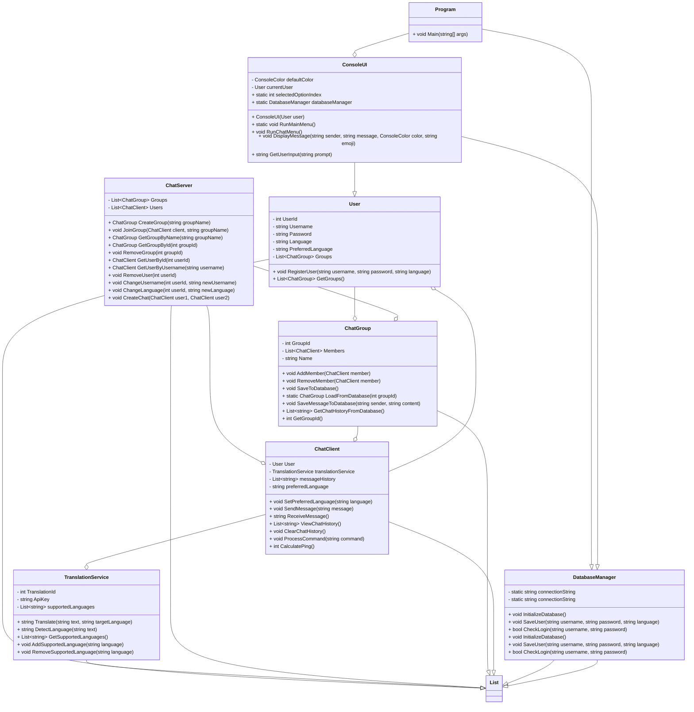

# HiksChat

HiksChat is a chat application that was developed in C# and offers various functions for user and group management as well as for communication. Here is an overview of the most important classes and their functions:

## UML diagram

These classes work together to create a fully functional chat application that allows users to communicate with each other and organize group chats.
